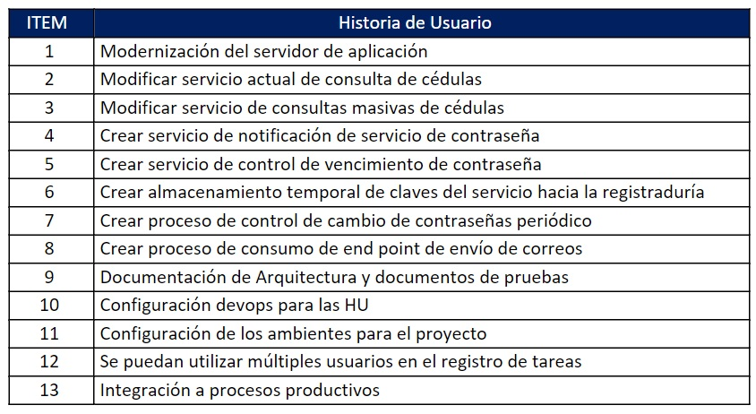
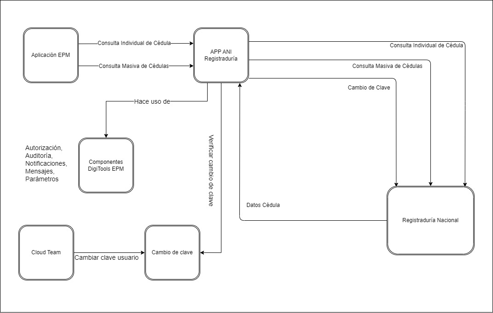
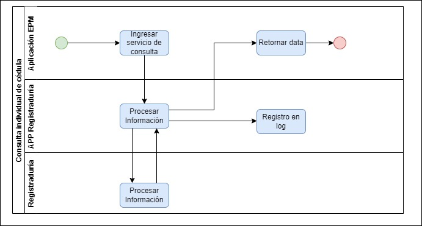
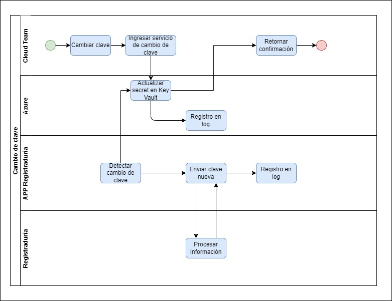
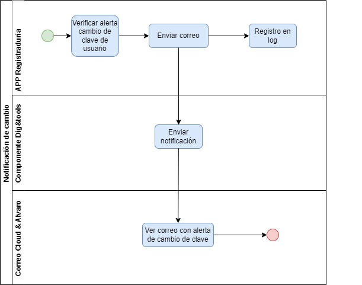

# Contexto de la Solución.

[Regresar al principal](../../plantilla-arquitectura-aplicacion.html)

## Alcance - StoryMapping.

## Diagrama de contexto del negocio.

<!---
la vista de contexto permite un análisis completo para la identificación de los actores y sistemas externos relacionados al Sistema
-->

La vista de contexto del sistema ANI Registraduría permite un análisis completo para la identificación de los actores y sistemas externos relacionados al sistema.  Esto permite determinar de manera precisa los limites del sistema y el entorno en que tiene validez cada funcionalidad.

El diagrama que se presenta a continuación representa el contexto del sistema, describiendo los componentes internos y externos para aplicar.

- **Aplicación EPM**
Aplicaciones en el dominio de EPM que requieren información de las cédulas en la Registraduría del estado.

- **App ANI Registraduría**
Aplicación que permite la consulta individual o masiva de cédulas

- **Registraduría Nacional**
Aplicación del estado que permite la consulta individual o masiva de cédulas

- **Componente Digitools De EPM**
Componente con servicios de autorización, auditoría, notificaciones, mensajes y parámetros

- **Cloud Team**
Equipo a cargo de cambiar información en el servicio Key Vault de azure

- **Cambio de clave**
Servicio que permite el cambio de clave en Key Vault azure

## Diagrama de procesos del negocio.

### Diagrama de Proceso Consulta de Cédulas de Identidad

### Diagrama de Proceso Consulta Masiva de Cédulas de Identidad

### Diagrama de Proceso Cambio de Clave Usuario de Consulta

### Diagrama de Proceso Notificación Cambio de Clave Usuario de Consulta

## Diagrama de entidades de negocio.

- No Aplica: Este sistema es un puente de comunicación entre el sistema de consultas de cédula de Registraduría y las aplicaciones de EPM.