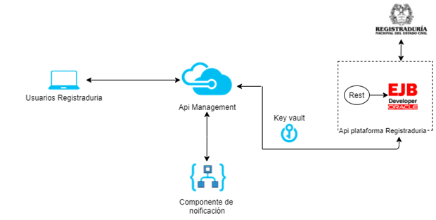

# Alternativa 1: Alternativa EJB.

[Regresar al principal](../../plantilla-arquitectura-aplicacion.html)

Enterprise JavaBeans es un modelo de componente estándar del lado del servidor para aplicaciones empresariales distribuidas. La especificación EJB forma parte de Java™ Platform Enterprise Edition.
EJB 3.0 facilita el desarrollo de los EJB, utilizando anotaciones en lugar de los descriptores de despliegue complejos utilizados en la versión 2.x. 

#### Ventajas:

Un EJB a través de un "EJB Container" ofrece varios servicios y funcionalidades no disponibles en un "Java Bean", algunas son las siguientes:

- Servicios Simplicidad. Debido a que el contenedor de aplicaciones libera al programador de realizar las tareas del nivel del sistema, la escritura de un enterprise bean es casi tan sencilla como la escritura de una clase Java. El desarrollador no tiene que preocuparse de temas de nivel de sistema como la seguridad, transacciones, multi-threading o la programación distribuida. Como resultado, el desarrollador de aplicaciones se concentra en la lógica de negocio y en el dominio específico de la aplicación.

- Portabilidad de la aplicación. Una aplicación EJB puede ser desplegada en cualquier servidor de aplicaciones que soporte J2EE.

-	Reusabilidad de componentes. Una aplicación EJB está formada por componentes enterprise beans. Cada enterprise bean es un bloque de construcción reusable. Hay dos formas esenciales de reusar un enterprise bean a nivel de desarrollo y a nivel de aplicación cliente. Un bean desarrollado puede desplegarse en distintas aplicaciones, adaptando sus características a las necesidades de las mismas. También un bean desplegado puede ser usado por múltiples aplicaciones cliente.

-	Posibilidad de construcción de aplicaciones complejas. La arquitectura EJB simplifica la construcción de aplicaciones complejas. Al estar basada en componentes y en un conjunto claro y bien establecido de interfaces, se facilita el desarrollo en equipo de la aplicación.

-	Separación de la lógica de presentación de la lógica de negocio. Un enterprise bean encapsula típicamente un proceso o una entidad de negocio. (un objeto que representa datos del negocio), haciéndolo independiente de la lógica de presentación. El programador de gestión no necesita de preocuparse de cómo formatear la salida; será el programador que desarrolle la página Web el que se ocupe de ello usando los datos de salida que proporcionará el bean. Esta separación hace posible desarrollar distintas lógicas de presentación para la misma lógica de negocio o cambiar la lógica de presentación sin modificar el código que implementa el proceso de negocio.

-	Despliegue en muchos entornos operativos. Entendemos por entornos operativos el conjunto de aplicaciones y sistemas (bases de datos, sistemas operativos, aplicaciones ya en marcha, etc.) que están instaladas en una empresa. Al detallarse claramente todas las posibilidades de despliegue de las aplicaciones, se facilita el desarrollo de herramientas que asistan y automaticen este proceso. La arquitectura permite que los beans de entidad se conecten a distintos tipos de sistemas de bases de datos.

-	Despliegue distribuido. La arquitectura EJB hace posible que las aplicaciones se desplieguen de forma distribuida entre distintos servidores de una red. El desarrollador de beans no necesita considerar la topología del despliegue. Escribe el mismo código independientemente de si el bean se va a desplegar en una máquina o en otra (cuidado: con la especificación 2.0 esto se modifica ligeramente, al introducirse la posibilidad de los interfaces locales).

-	Interoperabilidad entre aplicaciones. La arquitectura EJB hace más fácil la integración de múltiples aplicaciones de diferentes vendedores. El interfaz del enterprise bean con el cliente sirve como un punto bien definido de integración entre aplicaciones.

-	Integración con sistemas no-Java. Las APIs relacionadas, como las especificaciones Connector y Java Message Service (JMS), así como los beans manejados por mensajes, hacen posible la integración de los enterprise beans con sistemas no Java, como sistemas ERP o aplicaciones mainframes.

-	Recursos educativos y herramientas de desarrollo. El hecho de que la especificación EJB sea un estándar hace que exista una creciente oferta de herramientas y formación que facilita el trabajo del desarrollador de aplicaciones EJB.

-	Entre las ventajas que aporta esta arquitectura al cliente final, destacamos la posibilidad de elección del servidor, la mejora en la gestión de las aplicaciones, la integración con las aplicaciones y datos ya existentes y la seguridad.

-	Elección del servidor. Debido a que las aplicaciones EJB pueden ser ejecutadas en cualquier servidor J2EE, el cliente no queda ligado a un vendedor de servidores. Antes de que existiera la arquitectura EJB era muy difícil que una aplicación desarrollada para una determinada capa intermedia (Tuxedo, por ejemplo) pudiera portarse a otro servidor. Con la arquitectura EJB, sin embargo, el cliente deja de estar atado a un vendedor y puede cambiar de servidor cuando sus necesidades de escalabilidad, integración, precio, seguridad, etc.lo requieran.

-	Existen en el mercado algunos servidores de aplicaciones gratuitos (JBOSS, el servidor de aplicaciones de Sun, etc.) con los que sería posible hacer unas primeras pruebas del sistema, para después pasar a un servidor de aplicaciones con más funcionalidades.

-	Gestión de las aplicaciones. Las aplicaciones son mucho más sencillas de manejar (arrancar, parar, configurar, etc.) debido a que existen herramientas de control más elaboradas.

-	Integración con aplicaciones y datos ya existentes. La arquitectura EJB y otras APIs de J2EE simplifican y estandarizan la integración de aplicaciones EJB con aplicaciones no Java y sistemas en el entorno operativo del cliente. Por ejemplo, un cliente no tiene que cambiar un esquema de base de datos para encajar en una aplicación. En lugar de ello, se puede construir una aplicación EJB que encaje en el esquema cuando sea desplegada.

-	Seguridad. La arquitectura EJB traslada la mayor parte de la responsabilidad de la seguridad de una aplicación de el desarrollador de aplicaciones al vendedor del servidor, el Administrador de Sistemas y al Desplegador (papeles de la especificación EJB) La gente que ejecuta esos papeles están más cualificados que el desarrollador de aplicaciones para hacer segura la aplicación. Esto lleva a una mejor seguridad en las aplicaciones operacionales.

#### Desventajas:

-  Dependencia de la tecnología para el mantenimiento y reutilización de la aplicación. Una vez que la aplicación ha sido realizada en función del esquema de EJBs, es muy costoso pasar el trabajo a otro sistema que no incluya esta tecnología, lo cual podría ser necesario por motivos de mantenimiento (migración del sistema a otra tecnología) o reutilización, tanto de código.

-	Hay que aprender a realizar aplicaciones basadas en EJBs, lo cual conlleva su esfuerzo. La API de EJBs no es sencilla, ya que hay que seguir un esquema predefinido de herencias en el diagrama de clases que no es del todo intuitivo. Además hay que definir el deployment descriptor, lo que también conlleva el estudio de cómo hacerse.