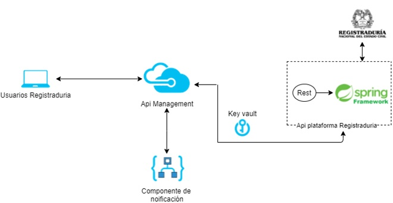

# Alternativa 2: Alternativa aplicación Spring Framework.

[Regresar al principal](../../plantilla-arquitectura-aplicacion.html)

Un framework, es un conjunto de herramientas y librerías que facilitan el desarrollo de una aplicación, permitiendo la reutilización de código previamente preparado para la ejecución de cierta tarea, por lo tanto, Spring se trata de un marco de trabajo compuesto de herramientas y utilidades ideales para la creación de aplicaciones web mediante el lenguaje programación Java.

#### Ventajas:

- El framework Spring es muy versátil pues se divide en módulos diseñados para solventar diferentes necesidades. Por ejemplo, el módulo Spring-Core nos permite reducir líneas de código; es decir, si tenemos un bloque de código de unas 50 líneas nos la reduce a 3 líneas. Y el módulo relacionado a la configuración de visibilidad y gestión de objetos, unifica distintas APIs de gestión y coordina dichas transacciones.

- Desarrollo web sobre REST API; con el cual el framework spring hace gestión de la petición, realiza el análisis correspondiente de datos y luego decide en qué clase de Java procesará los datos.

- Permite el desarrollo de aplicaciones flexibles y escalables; es decir, a medida que crezca el programa, su mantenimiento siempre será fácil pues el código será fácil de entender.

- Promueve una alta cohesión (enfoque preciso del propósito de una clase) y un bajo acoplamiento (interconexión o dependencia entre clases).

- Promueve el uso de POJO’s para su codificación. POJO’s se refiere al uso de clases simples y que no dependen de un framework en especial. Objetos creados simplemente con miembros y estos con sus getters y setter correspondientes y no heredan de nadie.

- Está basado en la programación orientada a interfaces. (significa que podemos cambiar la implementación de una clase de manera programativa o declarativa en tiempo de ejecución).

- Utiliza el patrón DI (Dependency Injection), este patrón gestiona las dependencias de objetos entre las clases de la aplicación, en lugar de ser ellas quienes las gestionen.

- Utiliza AOP (programación orientada a aspecto) paradigma que permite desacoplar ciertas responsabilidades mejorando la escalabilidad de la aplicación.

#### Desventajas:

- La configuración de Spring está inflada, es decir, para cada servicio que se tenga hemos de configurarlo en un XML de configuración. Aunque hay otras formas de configuración de Spring aparte del XML puro: programando por medio de la API, mediante un estándar JSR y con un mínimo XML y anotaciones.

- No se puede evaluar si un objeto ha sido bien inyectado más que en tiempo de ejecución. Aunque hay herramientas como Spring IDE que sí que ayudan.

- El contenedor de Spring no es ligero (si se usan todos los módulos disponibles), no es recomendable su uso en aplicaciones de tiempo real o en aplicaciones para móviles.

- Tiempo de aprendizaje, tendremos que invertir tiempo en superar la curva de aprendizaje para poder comenzar un nuevo desarrollo utilizando el framework.

- Versiones inestables. El hecho de que los frameworks sean tan populares provoca que estén en constante actualización para cumplir con las nuevas tecnologías y las nuevas políticas de seguridad. Por ello, si en el desarrollo surgen incompatibilidades con otras librerías o se detectan errores de seguridad, la elección de una versión muy reciente del framework podría ralentizar el proceso.

- Menor rendimiento. Los frameworks consumen, en general, más recursos que una aplicación creada desde cero y orientada al rendimiento. En aplicaciones muy exigentes, un framework puede resultar poco apropiado.

- Código sin utilizar. Si la aplicación es pequeña o no requiere mucha funcionalidad, probablemente estaremos desaprovechando mucho código que viene implementado en el framework, por lo que la aplicación ocupará más espacio del que realmente necesitaría.

- Elección del framework. Puede resultar complicado elegir cuál es el framework en el que te vas a especializar, ya que existe una gran variedad, y cada uno posee sus propias características. Por lo que, antes de lanzarse a aprender un framework nuevo, hay que dedicar tiempo a estudiar cuáles son los que tienen una base más sólida, ya que puede ocurrir que tras comenzar a desarrollar con un framework poco usado, se quede desactualizado al poco tiempo.