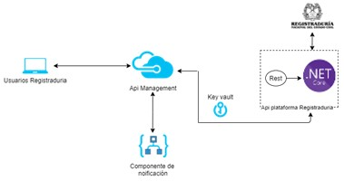

# Alternativa 3: Alternativa Aplicación .NET Core API

[Regresar al principal](../../plantilla-arquitectura-aplicacion.html)

.NetCore es un marco multiplataforma de código abierto, con él es posible crear aplicaciones modernas habilitadas para la nube y servicios web, esto mediante el lenguaje de programación c#. Para su utilización se cuenta con un conjunto de herramientas de desarrollo facilitadas por Microsoft, las cuales están disponibles para diferentes sistemas operativos.

#### Ventajas:

-	 El framework provee facilidades para la creación de servicios web de tipo SOAP y REST, los cuales van a ser utilizados en el flujo del proceso del negocio.

-	Se cuenta con una arquitectura de microservicios que permite una combinación de tecnologías a través de un límite de servicio.  Esta combinación de tecnología permite una adaptación gradual de .NET Core para nuevos microservicios. Por ejemplo, puede mezclar microservicios o servicios desarrollados con .NET Framework u otras tecnologías.

-	Nos asegura un buen rendimiento, esto significa que las aplicaciones cuentan con mejores tiempos de respuesta y requieren menos potencia. La eficiencia y escalabilidad obtenida puede traducirse en una mejor experiencia de usuario, además del ahorro de costos.

-	Es un framework de bastante reconocimiento, por lo que se cuenta con miles de extensiones de Microsoft y de terceros.

-	NET Core proporciona beneficios de seguridad inmediatos a través de su tiempo de ejecución administrado. Una colección de servicios evita problemas críticos como la manipulación de punteros incorrectos o intentos malintencionados de modificar el código compilado.

-	De código abierto y centrado en la comunidad, por lo que proporciona buen soporte, se actualiza para la seguridad y la calidad varias veces al año. Las distribuciones binarias de .NET Core se crean y prueban en servidores mantenidos por Microsoft en Azure.

#### Desventajas:

- Requiere tiempo y esfuerzos adicionales para que los desarrolladores que no han tenido experiencia en esta tecnología tengan alta productividad.

-	Herramientas de desarrollo basadas en Windows. Las herramientas de desarrollo funcionan mejor con Windows.

-	No admite aplicaciones de Windows Presentation Foundation (WPF) y Windows Forms.

-	Es posible que resulte un poco más costoso, esto debido a cargos adicionales como licencias de Visual Studio, licencias de Windows Server y licencias de SQL Server. Además, es posible que se tengan que utilizar otros recursos del servidor web como PHP, lo que aumenta sus costos generales.

-	Necesita utilidades de terceros, como Internet Service Manager, para tener acceso a las opciones de configuración de una aplicación web ASP, ya que se almacena en una metabase de IIS en un formato propietario. Además, la extracción y manipulación de la configuración es una tarea bastante arduo debido al soporte limitado.
