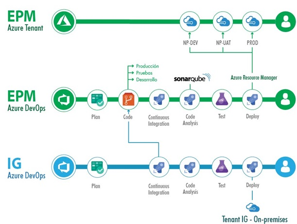
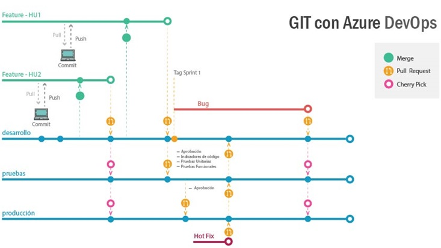
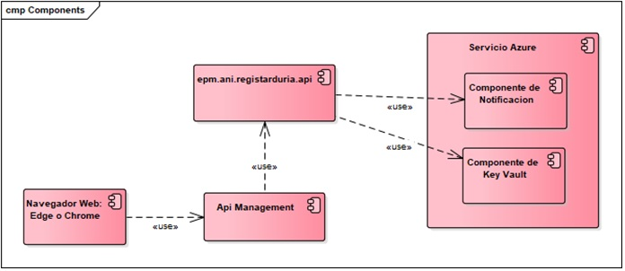
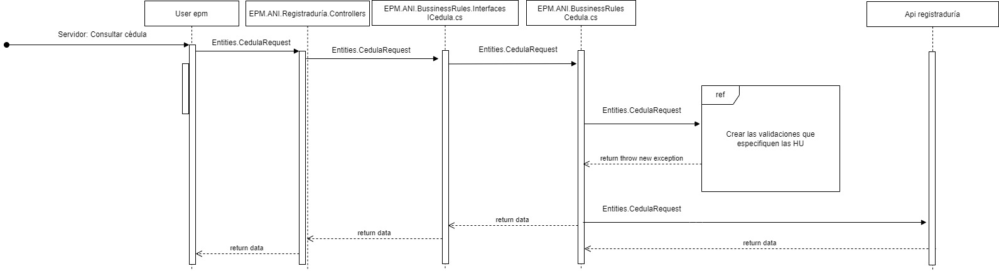
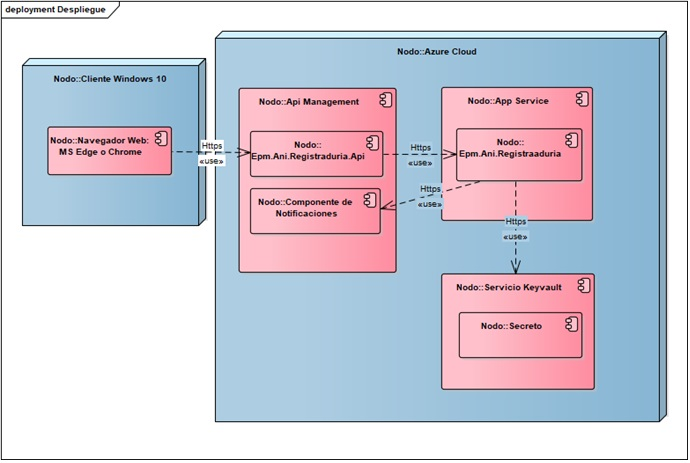

# Propuesta Arquitectónica.

<!--
Utilice los diferentes Tipos de Vistas que considere necesario para asegurar que las partes interesadas del proyecto van a poder entender las decisiones que se están tomando y sus implicaciones. Describa el contenido de cada vista representada. Evite descripciones sobre el tipo de vista a utilizar cómo: “Este es el modelo de vistas ‘x’ que fue inventado por ‘y’ y data de…”. Emplee los esfuerzos que sean necesarios para que el lector entienda fácilmente las vistas utilizadas, no para que el lector entienda conceptos de Arquitectura de Software. Cómo mínimo se consideran 3 diferentes tipos de vistas: Estáticas, Dinámicas y de Despliegue
-->

[Regresar al principal](../../plantilla-arquitectura-aplicacion.html)

## Estrategias Excepciones.

- La estrategia que se utilizará en este proyecto es la siguiente: La plataforma solo se encargará de las excepciones que se generen internamente tales como errores de conexión, de infraestructura o de integración.  Sin embargo es el servicio de Registraduría con el que la aplicación se integra quien devuelve las excepciones y errores que se puedan generar por las consultas. En este caso la aplicación toma la respuesta y la formatea para su debida visualización en capa de presentación.

- Se utilizaría el componente de Application Insights para la detección y manejo de errores y excepciones.

##  Estrategias Log.

- La estrategia que se utilizará para el manejo de logs es la siguiente: el log quedara solo en la capa de negocio y en la capa de repositorio.
- No se utilizará manejo de Log en la capa de presentación.
- Se utilizará el componente de Application Insights para el manejo de logs.

##  Estrategias Trazas.

- La estrategia que se utilizará para el manejo de trazas es la siguiente: se dejará trazabilidad de todos los procesos importantes en la aplicación para así con el componente de Application Insights detectar en que parte del proceso ocurrió alguna falla y así determinar el causante de este problema.

## Estrategias Seguridad.

- El ingreso a la aplicación se realiza a través de VPN para garantizar en primera instancia que solo los usuarios debidamente autorizados por VPN puedan hacer uso de la aplicación.
- La aplicación para poder ejecutar consultas al servicio de Registraduría debe disponer del usuario de consulta, el cual debe ser actualizada su contraseña como mínimo cada seis meses.
- Se utilizará el servicio de Key Vault para el manejo de secretos en los cuales estará el usuario generado de consulta y se actualizará la contraseña cada vez que sea cambiada.
- La información que viaja hacia y desde el servicio de Registraduría debe viajar encriptada y desencriptada en cada punto por medio de un par de llaves pública / privada generada por Registraduría mediante un convenio de integración con EPM.

## Practicas DevOps.

### Monitoreo Continuo.

- Se realizará con Application Insights

### Despliegue Continuo.

- Se crearán los pipelines de releases para el despliegue continuo en el portal de Azure.

- Los pipelines de releases son los siguientes: un ambiente en IG y tres ambientes en EPM los cuales son desarrollo, pruebas y producción.

### Pruebas Funcionales Automatizadas.

- No se llevarán a cabo pruebas funcionales automatizadas.

### Pruebas Unitarias.

- Se utilizará la practica TDD para el manejo de las pruebas unitarias.

### Inspección Continua.

- Se crearán los pipelines de build para que realicen la inspección continua del código fuente.

- Los pipelines de build son los siguientes: un ambiente en IG y tres ambientes en EPM los cuales son desarrollo, pruebas y producción.

### Integración Continua.

- Se crearán los pipelines de build para que realicen la integración continua del código fuente.

- Los pipelines de build son los siguientes: un ambiente en IG y tres ambientes en EPM los cuales son desarrollo, pruebas y producción.

### Gestión de Errores.

- Para el manejo de gestión de errores se crearán Bugs a las User Story en el Azure DevOps del proyecto.

- Cuando se resuelvan estos Bugs, agregar el identificador del Bug y de la User Story en el Commit del código fuente para llevar una mejor trazabilidad de estas.

### Gestión de Tareas.

- Para el manejo de tareas se crearán Task a las User Story en el Azure DevOps del proyecto.

- Cuando se terminen las tareas, agregar el identificador de la Task y de la User Story en el Commit del código fuente para llevar una mejor trazabilidad de estas.

### Control de Código.

- Se utilizará GIT en Azure DevOps de EPM:

https://grupoepm.visualstudio.com/Integraciones_nube/_git/Integraciones.Registraduria-ANI

-   Se cumplirá la siguiente estrategia de ramificación:

### Control de Documentación.

-   Se utilizará SharePoint para el manejo de todos los documentos creados para el proyecto https://intergrupoig.sharepoint.com/sites/EEPPM/APPREGISTRADURIA/Documentos%20compartidos/Forms/AllItems.aspx.

- Para el manejo de Épicas, Feature, User Story, Task y Test Case se realizarán en los Boards de Azure DevOps creados para este proyecto.

## Pruebas de Desempeño.

- No Aplica

## Pruebas de Seguridad.

- No Aplica

## Usabilidad.

- No Aplica. Es un API.

## Alta Disponibilidad.

- Se requiere de una alta disponibilidad en la consulta individual o masiva de cédulas de identidad. Este atributo de calidad se cumplirá con la implementación del proyecto en .NET lo cuál al ser una aplicación pequeña su gestión puede hacerse en mucho menor tiempo y por ende estar disponible mucho más rápido.

## Resiliencia.

- No Aplica

## Escalabilidad.

- No se requiere inicialmente escalabilidad al tratarse de una aplicación pequeña y que actúa como puente entre el usuario y la Registraduría.

## Vistas Estáticas.

<!--Utilice los diferentes Tipos de Vista Estática que considere necesarios: Diagrama de Componentes, Clases…--> 

### Vistas Componentes.

### Vistas de Entidades.

- No Aplica

## Vistas Dinámicas.

<!-- Utilice los diferentes Tipos de Vista Dinámica que considere necesarios: Diagrama de Secuencia, Actividades… --> 

### Diagrama de Secuencia.

### Diagrama Lógico.

- No Aplica

## Diagrama de Despliegue.

Complete la siguiente tabla con el nombre de los recursos en los diferentes ambientes, incluya key vaults, funciones, contenedores, colas, tópicos, eventos, etc, con un prefijo de la aplicación según las reglas de nombramiento del cloud team de EPM.

| Recurso | Nombre Dllo | Nombre Uat | Nombre Prd |
| ------- | ----------- | ---------- | ----------- |
|    Resource Group     |       EPM-NP-DLLO-RG-Registraduria      |    EPM-NP-UAT-RG-Registraduria	        |      EPM-PROD-RG-Registraduria|
Api Management     |       epmapimdes      |    epmapimdes        |      apimepmprod       |
|    Key-Vault     |       https://kv-epm-np-key-dllo.vault.azure.net      |    https://kv-epm-np-key.vault.azure.net        |      https://kv-epm-prod-key.vault.azure.net       |
|    Application Insights     |       AI-EPM-NP-REGISTRADURIA-DLLO      |    AI-EPM-NP-REGISTRADURIA-UAT        |      AI-EPM-PROD-REGISTRADURIA       
|

Para las capacidades de los siguientes recursos tenemos:

- No Aplica

- No Aplica