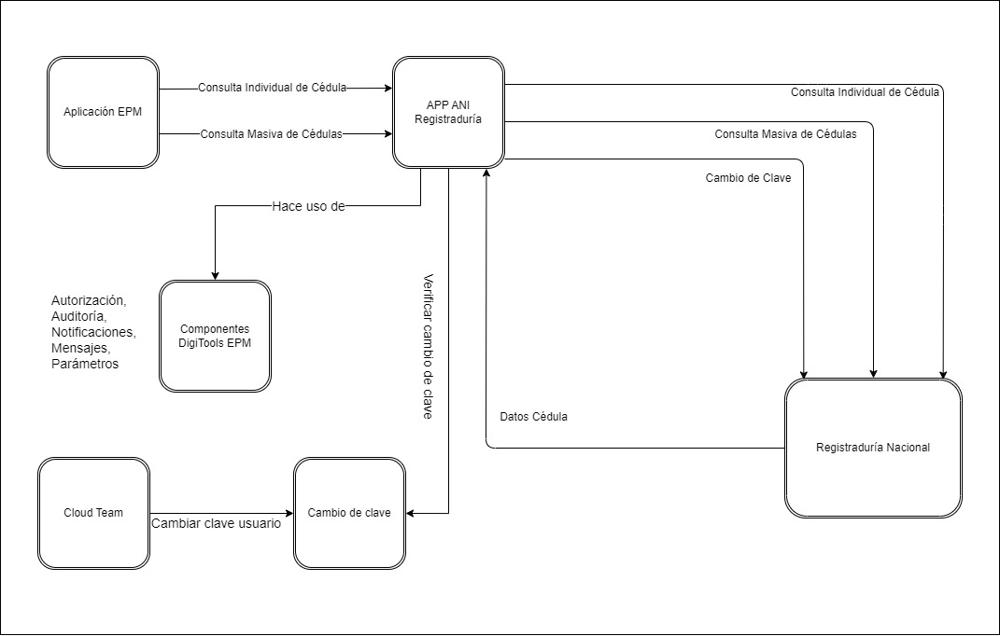

# Arquitectura de la Aplicación - ANI Registraduría

<!--- El Este documento tiene como propósito describir la Arquitectura de Software diseñada para satisfacer los requisitos de la solución.  
-->

## 1. Objetivo o propósito de la aplicación.
### Problema.

<!---
- Descripción del problema que resuelve la aplicación, consideramos todas las preocupaciones respecto al sistema expresadas por el <Negocio> y el valor que se puede generar al implementarla.
-->

Este documento tiene como propósito describir la arquitectura de software del proyecto ANI Registraduría, que será objeto de modernización debido a la generación de nuevos requerimientos y extensión de su funcionalidad, presentando los cimientos sobre los cuales estará construida.

Para el diseño de la arquitectura propuesta, consideramos todas las necesidades y preocupaciones expresadas respecto al sistema por Empresas Públicas de Medellin (EPM) a través de las diferentes reuniones de presentación y definición de los drivers arquitectónicos del sistema.

Se presentan múltiples propósitos a cumplir:

- Presentar una solución al negocio de consulta de cédulas de ciudadanía de forma individual y masiva. El sistema debe garantizar la comunicación en el proceso de integración con la Registraduría Nacional de Estado Civil y realizar la consulta de cédulas haciendo uso de un contrato expuesto mediante una integración que provee.
- La solución informática debe permitir el control de usuarios que realizan la consulta de cédulas.
- La solución informática debe permitir el cambio de credenciales de usuario de consulta de manera periódica.
- La solución informática debe permitir la notificación de caducidad de la contraseña en el intervalo de tiempo que se defina.
- La solución informática debe realizar el control de cambio de contraseña y reiniciar conteo de días de vigencia.
- La solución debe contar con el control de credenciales por medio de Key Vault.
- La solución informática debe proporcionar los servicios para realizar las acciones que son expuestas en el documento, ya que la solución no plantea una interfaz gráfica.
- Identificar riesgos potenciales que pueden afectar la implementación del sistema.
- Identificar conceptos del sistema que son relevantes a la arquitectura.
- Definir y delimitar el sistema mediante la definición de la arquitectura técnica y funcional.
- Definir y establecer directrices para la arquitectura con enfoques modernos.
- Definir y establecer directrices para el diseño e implementación del sistema.
- Identificar el uso de comportamientos comunes con el fin de que las implementaciones se hagan por medio de patrones y reutilización.
- Fomentar el uso de Clean Code y buenas prácticas en la implementación de las funcionalidades.
- Prácticas Devops

### Visión.

<!---
- Descripción del problema que resuelve la aplicación, consideramos todas las preocupaciones respecto al sistema expresadas por el <Negocio> y el valor que se puede generar al implementarla.
-->

Para el área de TI y la operación del negocio en la interfaz de comunicación con la Registraduría, se requiere mejorar los servicios actuales y extender la funcionalidad permitiendo cumplir con los procesos de seguridad entre EPM y Registraduría, modernizando la tecnología en la que actualmente la aplicación de consulta de cédulas hacia la Registraduría se encuentra construida.

Con la nueva aplicación de consulta de cédulas hacia la Registraduría se tendrán los siguientes atributos:

- Detección eficiente de fallas de manera especializada para los servicios o componentes del producto.
- Utilizar prácticas DevOps en el proyecto.
- Implementar buenas prácticas de desarrollo.
- Una arquitectura con enfoques modernos en tecnología.
- Integración con el sistema de seguridad propuesto por EPM.

## 2. Contexto de la solución.

<!--
- Se resuelve basado en la metodología Domain Drive Design (DDD).
-->

La app de Registraduría es una solución para facilitar la consulta de cédulas de manera individual y de manera masiva, como también el cambio de credenciales periódicas según lo establece la normativa de la Registraduría.

[Ver detalle](./detalle/2-contexto-de-la-solucion/contexto-de-la-solucion.html)

## 3.	Drivers Arquitectónicos.

### 3.1.	Funcionalidades Arquitectónicas.

<!--
Relacione las Funcionalidades que de alguna manera afectan la Arquitectura de Software del Proyecto. No todas las Funcionalidades modelan la Arquitectura, hay unas funcionalidades que exigen tomar Decisiones Arquitectónicas, y otras que se ajustan sobre las Decisiones ya tomadas. Nos interesa relacionar aquellas que exigen tomar Decisiones. RECOMENDACIÓN: Incluya por qué la Funcionalidad impacta la Arquitectura.
-->

Las funcionalidades más importantes que impactan la arquitectura son:

- Consulta Individual de Cédulas de Identidad.

- Consulta Masiva de Cédulas de Identidad.

- Cambio de Clave de usuario de consulta.

- Notificación de cambio de clave.

[Ver detalle](./detalle/3-drivers-arquitectonicos/funcionalidades-arquitectonicas.html)

### 3.2.	Restricciones Arquitectónicas.

<!--
Relacione las Restricciones Técnicas y de Negocio que afectan la Arquitectura de Software del Proyecto. Recuerde que los Estándares y ANS, son Restricciones.>
-->

### 3.2.1. Restricciones Técnicas.

Las restricciones técnicas de mayor importancia:

- Los servicios RESTFULL deben ser expuestos en el ambiente interno de API Management de EPM.

- El uso de secretos para las cadenas de conexión, conexión al servicio de API Management y datos sensibles en el proyecto se deben realizar mediante el servicio Azure KeyVault.

- Se debe utilizar Application Insights para todo el control y monitoreo de la aplicación.

- El servicio se debe integrar al sistema externo suministrado por la Registraduría Nacional del Estado Civil.

- Se debe implementar un mecanismo de encriptado y desencriptado de información acorde a los lineamientos y estándares exigidos por la Registraduría Nacional del Estado Civil.

[Ver detalle](./detalle/3-drivers-arquitectonicos/restricciones-tecnicas.html)

### 3.2.2. Restricciones Funcionales.

Las restricciones funcionales de mayor importancia:

- Los tiempos de consulta y de respuesta al BackEnd deben ser bajos.
  Nota: Se debe garantizar este tiempo internamente, el sistema no puede ni podrá controlar los tiempos de respuesta de la integración al tratarse de un sistema externo.

- Las consultas a realizar desde la plataforma se debe hacer internamente mediante usuarios del directorio activo de EPM.

- La notificación por correo se debe consumir por el servicio expuesto en Azure a través de API Management.

- La Registraduría Nacional del Estado Civil proporciona acceso a los web services por medio de un contrato inter administrativo con EPM y las consultas se deben hacer mediante llaves de encriptado y desencriptado.

- Toda la información que viaje por medio del API debe ser encriptado durante el viaje de la información. Por medio de un par de llaves públicas y privadas se podrá desencriptar y encriptar la información.

[Ver detalle](./detalle/3-drivers-arquitectonicos/restricciones-funcionales.html)

### 3.3.	Atributos de Calidad.

<!--
Caracterice los Atributos de Calidad que generan algún tipo de preocupación para las partes interesadas del Proyecto. Cómo Arquitecto, relacione también los Atributos de Calidad que son de su interés particular para este proyecto. Utilice como referencia el Modelo de Calidad ISO 25000. Para la caracterización de los Atributos de Calidad, use Escenarios de 6 Partes. Es importante mencionar que no necesariamente los atributos de calidad que se encuentran en la norma ISO 25000 son los únicos que pueden referenciarse. De igual manera, para un atributo de calidad, pueden existir varios escenarios a validar. Se recomienda que para identificar los atributos de calidad y los escenarios involucrados se realice un taller de identificación de estos (mini QAW). Es muy importante que se mencionen tanto las tácticas como las estrategias propuestas para alcanzar el escenario de calidad, y desde donde se pueda seleccionar la que más se ajusta a las expectativas del cliente.
-->

Los atributos de calidad por el dominio de mayor importancia son:

Consulta de Cédulas de Identidad (Individual y masivo)

- Seguridad
   - Autenticarse al servicio de ANI Registraduría.
   - Renovar el usuario de consulta de la API periódicamente.

- Disponibilidad
   - Acceso y gestión de consultas de cédulas de ciudadanía.

- Testeabilidad
   - Validar la gestión de consultas de cédulas de ciudadanía.

- Mantenibilidad
   - Gestionar el estado de salud del servicio en muy poco tiempo.

- Adaptabilidad
   - El servicio se debe poder consultar desde cualquier aplicación dentro del dominio de EPM.

[Ver detalle](./detalle/3-drivers-arquitectonicos/atributos-de-calidad.html)

### 3.4. Supuestos Arquitectónicos.

<!--
Describa todos los supuestos a los que haya lugar y que complementen la descripción de los Drivers Arquitectónicos del sistema. Por ejemplo: Asumimos que el Autenticación (componente externo del cliente) tendrá un tiempo de respuesta entre 2 y 5 segundos para dar cumplimiento al Escenario de Calidad x. Tenga en cuenta que los supuestos pueden afectar las métricas de los escenarios de calidad.
-->

A continuación, describimos los supuestos que complementan la descripción de los drivers arquitectónicos del sistema:

- Se asume que para dar cumplimiento al atributo de calidad de seguridad se deben implementar los lineamientos de seguridad exigidos por Registraduría para la integración con el servicio expuesto por ellos; de igual forma, este servicio debe garantizar la actualización de la clave de acceso del usuario de consulta cada 6 meses como mínimo.

 - Se debe dar cumplimiento con los lineamientos mínimos requeridos de arquitecturas modernas definidas entre IG y EPM para garantizar la disponibilidad y el acceso a los recursos entre Registraduría y EPM y con ellos garantizar un óptimo servicio de consulta de cédulas de ciudadanía.

- Se deban utilizar las prácticas DevOps establecidas entre IG y EPM tales como monitoreo continuo, despliegue continuo, pruebas unitarias, pruebas de seguridad, integración continua, gestión de errores, gestión de tareas, control de código, control de documentación que garanticen la correcta ejecución de todos los servicios y la gestión de los recursos.

- Para dar cumplimiento al atributo de disponibilidad se debe garantizar el servicio las 24 horas al día, los 7 días a la semana y que los tiempos de interrupción que se presenten, sean mínimos y se garantice una estabilización pronta del servicio.

- Se debe garantizar el acceso al servicio de consultas de cédulas a usuarios del dominio activo de EPM, también se debe garantizar un servicio API de fácil integración para que sea utilizado por cualquier aplicación que requiera prestar este servicio de consulta dentro de sus operaciones de negocio.

[Ver detalle](./detalle/3-drivers-arquitectonicos/supuestos-arquitectonicas.html)

## 4.   Alternativas de solución.

<!--
Para satisfacer las funcionalidades y atributos de calidad se considerarán como mínimo 3 alternativas de solución para satisfacer los escenarios de arquitectura. De igual manera, mencione los estilos arquitectónicos, arquitecturas de referencia o arquetipos base de la organización a partir de los cuales se ha realizado la propuesta arquitectónica para la aplicación
-->

### 4.1 Alternativa 1: Aplicación Enterprise Java Beans (EJB).  

[Ver detalle](./detalle/4-alternativas-de-solucion\alternativa1.html)

### 4.2 Alternativa 2: Aplicación Java Spring Framework.

[Ver detalle](./detalle/4-alternativas-de-solucion\alternativa2.html)

### 4.3 Alternativa 3: Aplicación .NET Core API.

[Ver detalle](./detalle/4-alternativas-de-solucion\alternativa3.html)

## 5. Decisiones Arquitectónicas.

<!--
Describa cada una de las Decisiones Arquitectónicas que se toman para dar respuesta a los Drivers Arquitectónicos Planteados. Prefiera el uso de Patrones Arquitectónicos para solucionar problemas recurrentes. Use referencias Bibliográficas cuando sea apropiado para describir los Patrones y Tácticas a utilizar.
-->

Se elige la propuesta **Alternativa 3: Aplicación .NET Core API** en la que se encuentran inmersas las decisiones arquitectónicas que pretenden apoyar los beneficios y funcionalidades listadas en las necesidades de negocio, reflejado en la siguiente imagen:

[Ver detalle](./detalle/5-decisiones-arquitectonicas/decisiones-arquitectonicas.html)

## 6. Propuesta Arquitectónica.

<!--
Utilice los diferentes Tipos de Vistas que considere necesario para asegurar que las partes interesadas del proyecto van a poder entender las decisiones que se están tomando y sus implicaciones. Describa el contenido de cada vista representada. Evite descripciones sobre el tipo de vista a utilizar cómo: “Este es el modelo de vistas ‘x’ que fue inventado por ‘y’ y data de…”. Emplee los esfuerzos que sean necesarios para que el lector entienda fácilmente las vistas utilizadas, no para que el lector entienda conceptos de Arquitectura de Software. Cómo mínimo se consideran 3 diferentes tipos de vistas: Estáticas, Dinámicas y de Despliegue
-->

[Ver detalle](./detalle/6-propuesta-arquitectonica/propuesta-arquitectonica.html)

## 7. Validación de la Propuesta Arquitectónica.

<!-- Describa cómo se validará el cumplimiento de los Drivers Arquitectónicos. Por ejemplo, para dar cumplimiento al Escenario xxx que se refiere a Rendimiento, se va a construir una prueba de concepto que simulara el escenario descrito con el objetivo de garantizar su cumplimiento. Recuerde que no es necesario construir siempre una nueva Prueba de Concepto, reutilice Pruebas de concepto de soluciones anteriores. Sólo en casos muy reducidos y sólo cuando este muy seguro del cumplimiento de un Driver Arquitectónico, refiérase a su experiencia previa, la cual tendrá que ser sustentada en la Revisión Interna de Arquitectura y por supuesto con el Cliente. De igual manera, se puede hacer referencia a las pruebas de concepto ya realizadas y que han sido documentadas de forma detallada dentro de las bitácoras respectivas. La idea no es repetir aquellas pruebas que ya han sido realizadas por otro equipo previamente y que buscan validar el mismo contexto -->

Pruebas de concepto de mayor importancia:

- <a href="https://aplicaciones.epm.com.co/interno/alejandriadocumentacion/pages/GuiasYLineamiento/Seguridad/AutenticacionADFS/AutenticacionADFS.html" target="_blank">Prueba de Concepto Componente Autenticación</a>

- <a href="https://aplicaciones.epm.com.co/interno/alejandriadocumentacion/pages/Experimentacion/Backend/Application%20Insights/AplicationInsights.html" target="_blank">Prueba de Concepto Application Insights</a>

- <a href="https://aplicaciones.epm.com.co/interno/alejandriadocumentacion/pages/GuiasYLineamiento/Interoperabilidad/Monitoreo/Lineamientos/AgregarAI_ApiManagement.html" target="_blank">Prueba de Concepto Application Insights en Api Management</a>

[Ver detalle](./detalle/7-validacion-de-la-propuesta-arquitectonica/validacion-de-la-propuesta-arquitectonica.html)

## 8. Riesgos.

Riesgos de mayor importancia:

- Integración con servicio de Registraduría

- Servicios Cloud de Azure

- Sistema de Encriptado y Desencriptado de la Información.

[Ver detalle](./detalle/8-riesgos/riesgos.html)

## 9. Anexos.

<!-- 
A continuación documente la información correspondiente a los anexos relacionados con su propuesta arquitectónica
-->

- Anexo 01: Herramientas y tecnologías utilizadas por la solución.

- Anexo 02: Documentos relacionados.

- Anexo 03: Vocabulario.

- Anexo 04: Referencias de apoyo

[Ver detalle](./detalle/9-anexos/anexos.html)

## 10. Contactos de Apoyo.

- ALVARO JOHN MONTIEL VASQUEZ (alvaro.john.montiel@epm.com.co)

## 11. Revisiones y Aprobaciones.

|**Versión**|**Fecha dd/mm/aaaa**|**Autor**|**Estado**|**Revisado por**|**Aprobado por**|**Descripción modificación**|
| :-: | :-: | :-: | :-: | :-: | :-: | :-: |
| 1.0 | 08/11/2022 | JOEL DARIO RAMIREZ GAMBOA | CREACIÓN ||| CREACIÓN DEL DOCUMENTO |
| 1.0 | 09/02/2023 | PEDRO LUIS OSORIO PAVAS | MODIFICACIÓN ||| CORRECCIONES DE REDACCIÓN |
